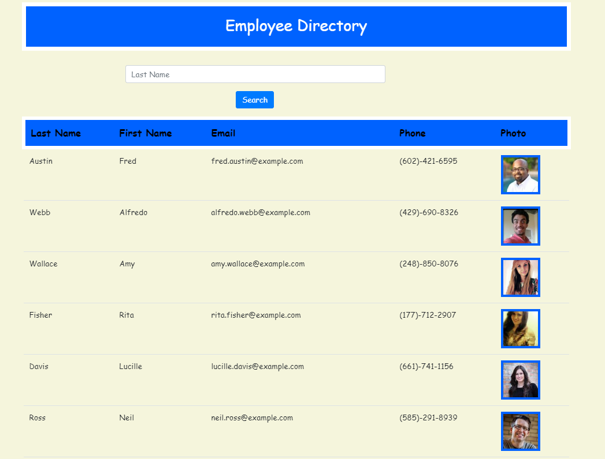

# Employee-Directory

##  Homework 19

## Instructions

In this React app, the user can search for his/her employees information by sorting their information by their last name. It will load all the employees who have the same last name and display their photo, last and first name, email and phone number.  

## User Story

* As a user, I want to be able to view my entire employee directory at once so that I have quick access to their information.

## Business Context

An employee or manager would benefit greatly from being able to view non-sensitive data about other employees. It would be particularly helpful to be able to filter employees by name.

## Page Snapshot

## Github repository and deployed application

https://github.com/solka2019/Employee-Directory-React

https://solka2019.github.io/Employee-Directory-React/
